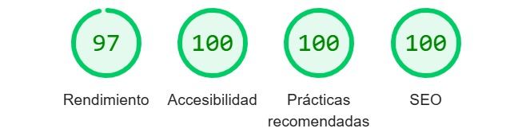

# 🖥️ PRUEBA TÉCNICA  

Proyecto de maquetación web realizado con **HTML, SCSS y JavaScript (ES Modules)**.  
Incluye un **hero slider con vídeos**, **galería dinámica desde JSON**, un **lightbox accesible**, diseño responsive y foco en **accesibilidad (A11y)**.

---

## 🔨 Instrucciones de build

Este proyecto usa **Vite** como bundler para compilar SCSS → CSS y servir el proyecto en local.

---

## ⚙️ 2. Decisiones técnicas

- **SCSS**: uso de variables, mixins y arquitectura modular por componentes.  
- **Mixins**: definidos para media queries y estilos responsive.  
- **JSON dinámico**: la galería carga imágenes y vídeos desde [`/data/gallery.json`](./public/data/gallery.json).  
- **Hero Slider**: implementado en JS nativo, con autoplay de vídeos, navegación con flechas, bullets accesibles y swipe en móvil.  
- **Lightbox accesible**: botón flotante que abre modal, cierre con tecla `Esc` y atributos ARIA.  
- **Accesibilidad (A11y)**:
  - Navegación completa por teclado.  
  - Roles ARIA (`role="dialog"`, `aria-hidden`, `aria-current`).  
  - Contrastes AA mínimos y foco visible.  
  - Imágenes optimizadas (`loading="lazy"`), vídeos con `poster`, CSS/JS minificado con Vite.  
- **SEO**: estructura semántica (encabezados), `alt` en imágenes y metadatos completos.  

---

## ✅ 3. Checklist de accesibilidad

- [x] Navegación completa con teclado (header, slider, filtros, lightbox).  
- [x] Atributos ARIA aplicados correctamente.  
- [x] Contraste AA mínimo en textos y botones.  
- [x] Estados de **focus** visibles y gestionados.  
- [x] Etiquetas y descripciones correctas (`aria-label`, `aria-describedby`).  

---

## 📊 4. Métricas Lighthouse

### Versión **Escritorio**

### Versión **Móvil**

> 📌 Las capturas están en la carpeta `/docs`.  
Si quieres ver los informes completos exportados en JSON:  
- [Informe Lighthouse Escritorio](./docs/data/silviatovardev.github.io-20250831T180904-desktop.json)  
- [Informe Lighthouse Móvil](./docs/data/silviatovardev.github.io-20250831T180953-mobile.json)  

---

